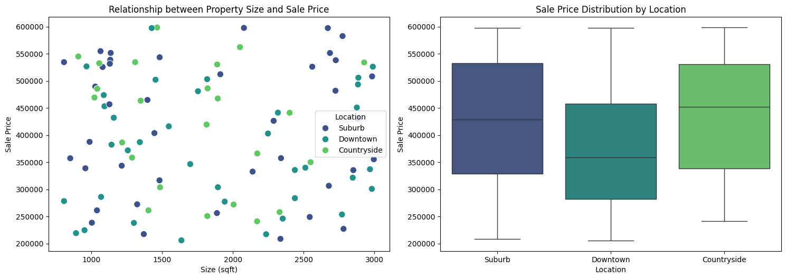

# Day 6: Real Estate Data Analysis

Welcome to **Day 6** of my **Datasets Challenge**!  
Today, I explored a **Real Estate Dataset** to understand how property characteristics like **size**, **location**, and **sale price** relate to each other.  
The goal was to uncover insights about pricing patterns and what factors influence property value the most.

---

## Dataset Overview

The dataset contains details about multiple properties, including:

| Column Name  | Description |
|---------------|-------------|
| `Size (sqft)` | Property size in square feet |
| `SalePrice`   | Sale price of the property (in USD) |
| `Location`    | Area where the property is located (Suburb, Downtown, Countryside) |

---

## Exploratory Data Analysis (EDA)

### Distribution Overview

Below are the key distributions of property characteristics:

- **Property Size**
- **Sale Price**
- **Property Count by Location**

📈  

**Observations:**
- Most properties range between **1,000–1,500 sqft**, showing smaller homes are more common.  
- Sale prices generally fall between **$200,000 and $600,000**, with a balanced spread — no extreme skewness.  
- **Suburban areas** have the highest property count, followed by **Downtown** and **Countryside**.

---

### 2️⃣ Relationship Between Size and Price

To explore how property size affects price, I plotted a scatter plot colored by location, alongside a boxplot to compare sale prices by location.

📊  

**Findings:**
- There is **no strong linear relationship** between size and sale price — the points are scattered randomly.  
- This implies that **other factors (like location and type)** play a stronger role in determining price.  
- **Suburban** and **Countryside** properties have higher median prices and more variation, while **Downtown** properties are priced more consistently.

---

### 3️⃣ Correlation Analysis

To quantify the relationship between **Size** and **Sale Price**, I computed the Pearson correlation coefficient:

📉 **Correlation = -0.031**

**Interpretation:**
- The weak negative value indicates **almost no correlation** between property size and sale price.  
- Larger properties are **not necessarily more expensive** in this dataset.  
- This reinforces that **location and other qualitative factors** are stronger price determinants.

---

## 💡 Key Insights

- **Location** significantly impacts property price, more than property size.  
- **Suburban and Countryside** areas show greater diversity in pricing, possibly reflecting different property types.  
- **Downtown** prices are lower but more stable — likely due to more uniform housing (apartments or condos).  
- **No linear correlation** between size and price suggests a complex, non-linear pricing structure in real estate markets.

---

## 📚 Tools & Libraries Used

- **Python**
- **Pandas** — data manipulation  
- **Matplotlib / Seaborn** — data visualization  

---

## 🖼️ Visual Summary

| Analysis Stage | Visualization |
|----------------|----------------|
| Distributions |  |
| Relationships |  |
| Correlation |  |

---

### 🚀 Conclusion
This analysis highlights that **real estate pricing isn’t just about square footage** — context and location matter greatly.  
Day 6 was about digging deeper into data interpretation and understanding how **correlations (or lack thereof)** can tell powerful stories.

---

**Author:** Caleb  
**Project:** 30 Days of Datasets Challenge — *Day 6: Real Estate Data Analysis*
