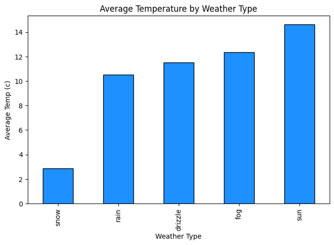
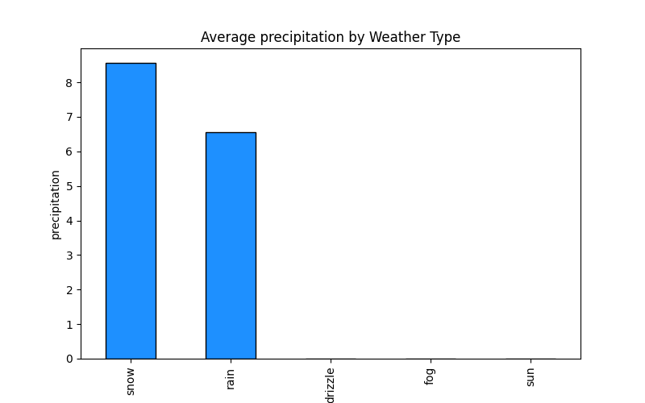
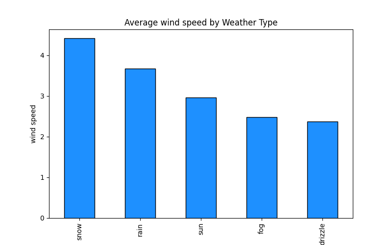

# Day 14: Weather Dataset Analysis

## Overview
On Day 14 of our 30-day dataset challenge, we focused on analyzing a **weather dataset**. The dataset contains daily weather information including **precipitation**, **maximum and minimum temperatures**, **wind**, and **weather type** (sun, rain, drizzle, snow, fog) for a period of time.

The goal was to understand **patterns, distributions, and relationships** between weather features and their seasonal trends.

---
[data source](https://www.kaggle.com/datasets/ananthr1/weather-prediction?resource=download)

## Dataset Description
The dataset includes the following columns:

| Column Name   | Description                               |
|---------------|-------------------------------------------|
| `date`        | Date of observation                        |
| `precipitation` | Amount of precipitation (mm)             |
| `temp_max`    | Maximum daily temperature (°C)           |
| `temp_min`    | Minimum daily temperature (°C)           |
| `wind`        | Wind speed (km/h)                          |
| `weather`     | Weather condition (sun, rain, drizzle, snow, fog) |

**Count & Summary Statistics**

- Total entries: 146
- Weather types: `'drizzle', 'rain', 'sun', 'snow', 'fog'`
- Patterns observed:
  - Temperature follows a **zigzag seasonal trend**: cooler at the start of the year, peaking mid-year, then cooling again.
  - Snow is associated with the **lowest temperatures**, sun with the **highest**.
  - Snow events were the most frequent (4.41%), followed by drizzle (2.37%), while sun and rain had lower counts.

---

## Key Visualizations

1. **Temperature Trends**
   - plot of `temp_max` and `temp_min` over time.
   - Shows clear **seasonal oscillation**.
   - 
     
3. **Average Temperatur By Weather**
   - bar charts to show the relationship between average temperature and weather types.
   - sun had the highest temperature with the least being snow.
   - 
     
3. **Precipitation & Weather**
   - bar charts to show the relationship between precipitation and weather types.
   - Snow had the highest precipitation values, followed by rain.
   - 

4. **Wind Speed by Weather**
   - bar charts to show the relationship between wind speed and weather types.
   - snow had highest wind speed with the least being drizzle.
   - 

---

## Conclusion
- Day 14 focused on **exploring weather patterns** and **seasonal trends**.
- Identified relationships between temperature, precipitation, and weather type.
- Data is consistent with real-world seasonal patterns, making it suitable for **predictive modeling** in future steps.

---

## Next Steps
- Analyze **correlations** between wind, precipitation, and temperature.
- Explore **forecasting models** using historical trends.
- Visualize **weather transitions** more dynamically over the year.

---

*This concludes Day 14 of the 30-day dataset challenge.*
