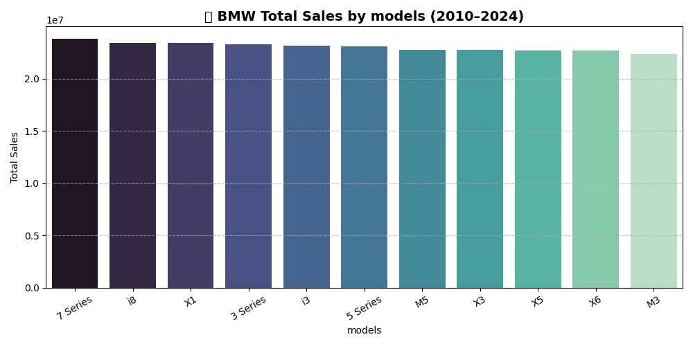
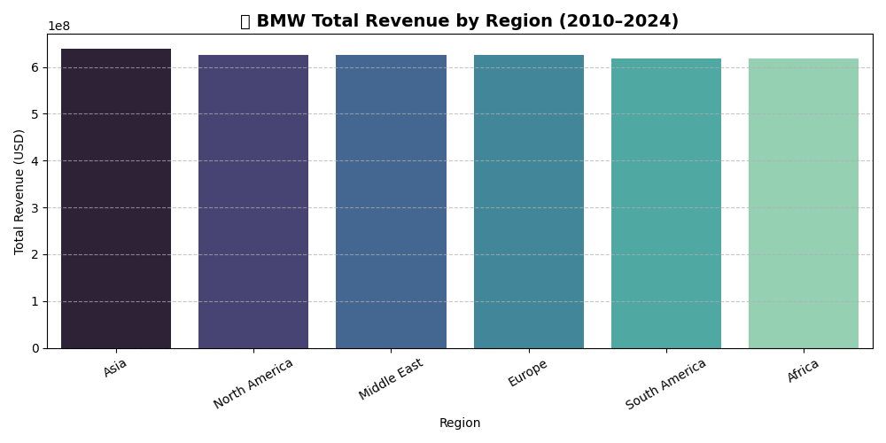
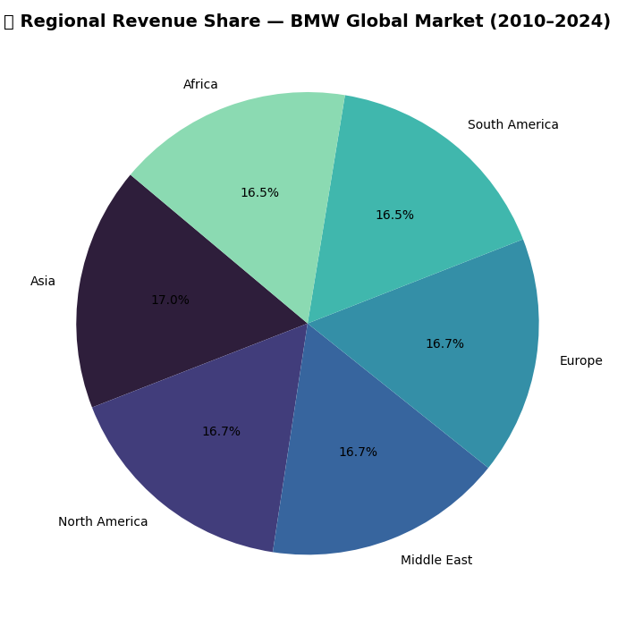
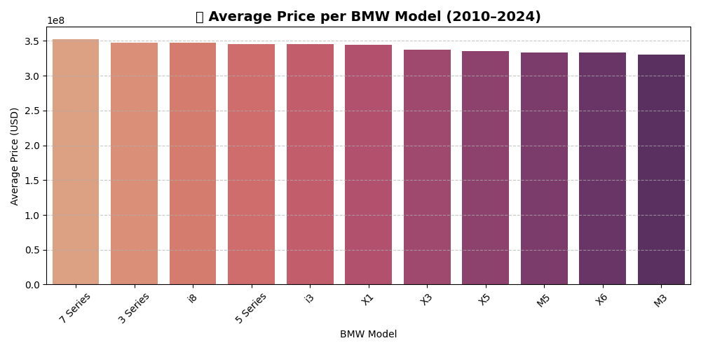
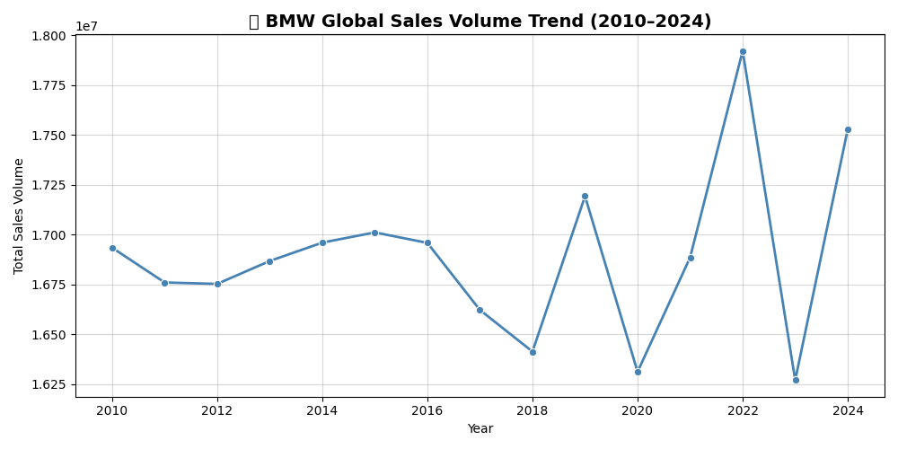

# 🚗 Day 17 — BMW Global Vehicle Sales Analysis (2010–2024)

## 📘 Dataset Overview
This dataset captures **BMW global sales** from 2010 to 2024, including attributes such as **model, year, engine size, mileage, transmission, fuel type, price, region, sales volume, and sales classification**.  
It enables analysts to study **market trends, model popularity, pricing strategies**, and the shift toward **electric and hybrid vehicles**.

---

cite : [kaggle_dataset](https://www.kaggle.com/datasets/ahmadrazakashif/bmw-worldwide-sales-records-20102024)

----

## 🎯 Objectives
- Analyze **sales distribution** across models and regions.  
- Identify  **top revenue-generating regions**.  
- Explore **fuel type adoption trends** (Hybrid, Electric, Petrol, Diesel).  
- Examine **sales trends**  over time.  
- Provide actionable insights into BMW’s **global market strategy**.

---

## 📊 Dataset Features

| Feature | Description |
|----------|--------------|
| `Model` | BMW car model (e.g., 3 Series, X5, i8, 7 Series) |
| `Year` | Year of manufacture or sale (2010–2024) |
| `Region` | Global region (Asia, Europe, North America, Middle East, Africa, South America) |
| `Color` | Vehicle color |
| `Fuel_Type` | Petrol, Diesel, Hybrid, Electric |
| `Transmission` | Automatic or Manual |
| `Engine_Size_L` | Engine capacity in liters |
| `Mileage_KM` | Vehicle mileage in kilometers |
| `Price_USD` | Sale price in USD |
| `Sales_Volume` | Number of units sold per model/year/region |
| `Sales_Classification` | High or Low sales category |

---

## 📈 Key Insights

### **1. Top Models by Sales Volume**
- **7 Series** leads globally with ~23.8M units sold.  
- **i8** and **X1** follow closely, showing strong EV/hybrid adoption.  
- **X-series SUVs** (X1, X3, X5, X6) remain highly popular, reflecting global SUV demand.  

### **2. Regional Revenue**
- **Asia** generates the highest revenue (~\$639M), followed by **Europe** and **North America**.  
- **Middle East** and **Africa** show strong per-unit revenue due to high-priced luxury models.  
- Revenue spread across regions is relatively balanced, demonstrating BMW’s **global market equilibrium**.

### **3. Fuel Type Trends**
- **Hybrid vehicles** lead total sales (≈64.5M units), followed by Petrol and Electric.  
- **Diesel** lags behind, highlighting BMW’s pivot to electrified powertrains.  

### **4. Yearly Trends**
- Sales are broadly stable with mild long‑term growth, ending higher in 2024 than 2010.  
- Decline into 2018 (near 16.4M), followed by a sharp uptick in 2019 (~17.2M)..  
- Pandemic trough (2020): Noticeable drop to the series low up to that point (~16.3M).  

---

### **Visuals**

**1. Top BMW Models by Sales Volume**  

**2. Regional Revenue Distribution**  

**3. Average Price per Model**  

**4. Yearly Trends**  

---

## 🧠 Analytical Takeaways
- BMW maintains a **balanced global presence** with near-equal revenue contributions from major regions.  
- **EV and hybrid adoption** is driving growth post-2020.  
- The **7 Series, i8, and X-series SUVs** remain core revenue and brand drivers.  

---

## 🛠️ Tools Used
- **Python**: Pandas, NumPy, Matplotlib, Seaborn  
- **Jupyter Notebook** for exploration and visualization  

---

## 🏁 Conclusion
This analysis provides a **comprehensive overview of BMW’s global market performance (2010–2024)**, highlighting **sales trends, model popularity, revenue drivers, and the transition toward hybrid/electric vehicles**.  
It equips analysts, marketers, and automotive enthusiasts with actionable insights for **strategic decision-making and market forecasting**.
