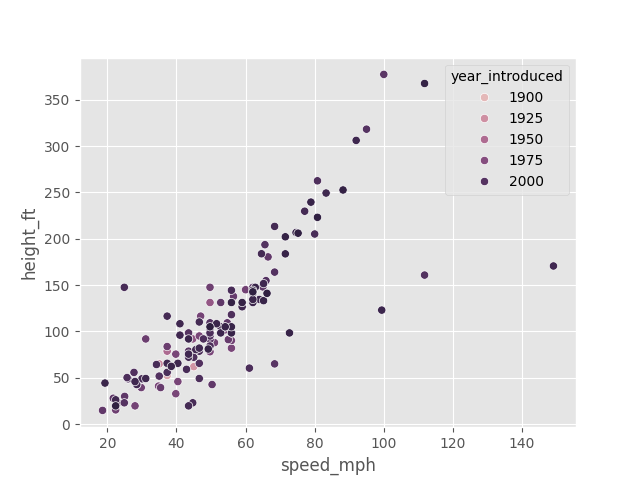
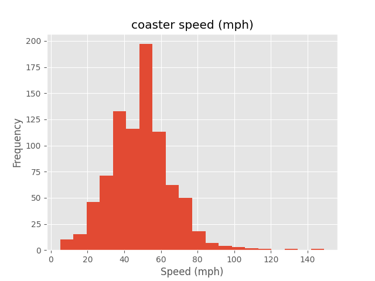
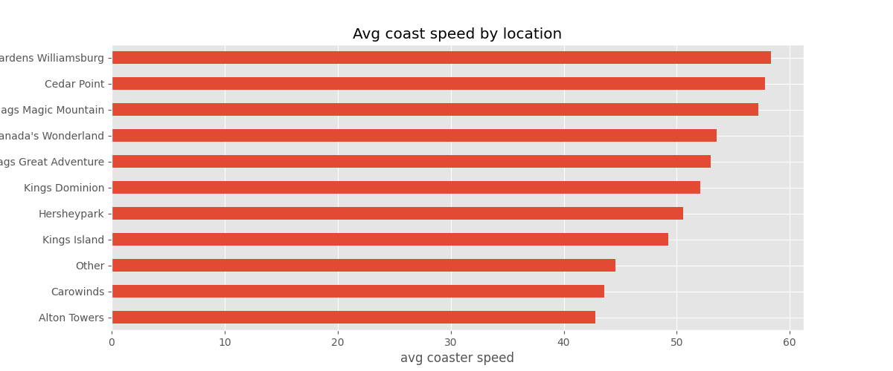

# Day 19 — Rollercoaster Dataset Analysis

## 📌 Overview

Day 19 of the 30 Days of Datasets challenge focuses on exploring the **Rollercoaster Database** from Kaggle. The dataset contains details about rollercoasters across the world, including their physical features, manufacturers, design elements, and performance metrics.

This analysis was conducted using the provided Jupyter Notebook, which includes data understanding, preparation, and feature exploration.

## 📂 Dataset Source

* **Dataset:** Rollercoaster Database
  [https://www.kaggle.com/datasets/robikscube/rollercoaster-database](https://www.kaggle.com/datasets/robikscube/rollercoaster-database)
* **Learned through YouTube:** Rob Mulla (@robmulla)
  [https://www.youtube.com/@robmulla](https://www.youtube.com/@robmulla)

## 🧠 Notebook Sections

Based on the structure of the notebook, the analysis includes:

### 1. **Data Understanding**

Initial exploration of the dataset's structure, columns, and general content.

### 2. **Data Preparation**

Cleaning and preprocessing steps such as:

* Renaming columns
* Formatting data types
* Handling missing or inconsistent values

### 3. **Feature Understanding**

Review and explanation of the important variables in the dataset.

### 4. **Feature Relationships**

Exploration of how key attributes relate to each other—for example:

* Height vs speed
* Length vs duration
* Rollercoaster type distribution

## 🔍 Key Learnings

From analyzing this dataset, we gain insights into:

* How rollercoaster characteristics influence performance
* Common manufacturers and coaster types worldwide
* Patterns in design and technical specifications

## 🎥 Learning Source

This analysis was inspired by tutorials from **Rob Mulla**, an excellent resource for practical data science walkthroughs.

## 📊 Visualizations 

Below are the visualization concepts included in this analysis. These describe what the notebook explores:

### **1. Distribution of Rollercoaster Types**

A bar chart showing top years when rollercoasters were introduced.

### **2. Height vs Speed Scatter Plot**

A scatter plot illustrating the relationship between coaster height and speed.

### **3. Coaster Speed Distribution**

A hist plot to show speed distribution.

### **5. Final Question**

Locations with the fastest roller coasters (min 10).

