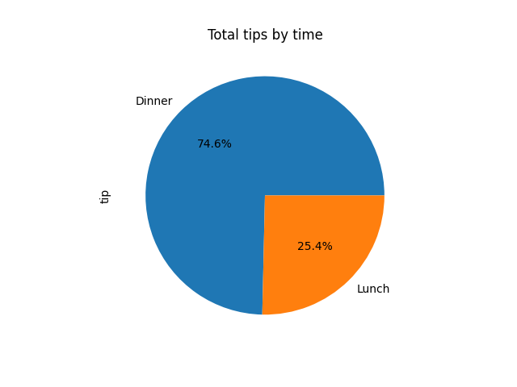
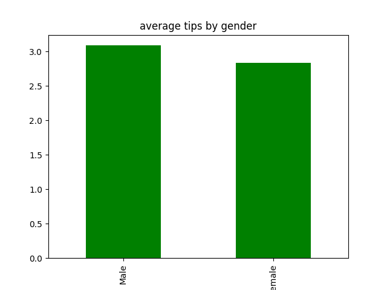
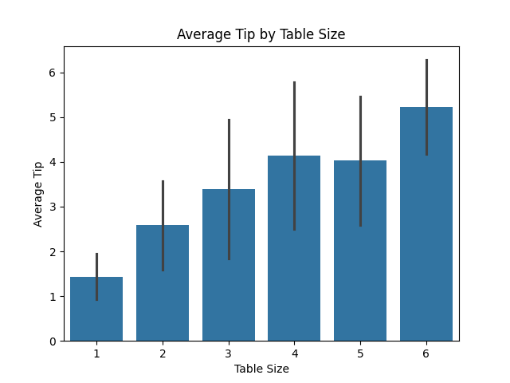
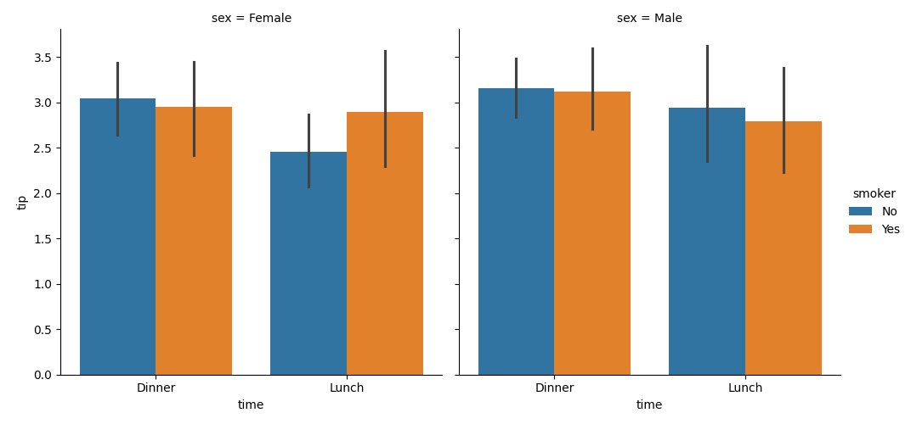

# 30 Days of Data - Day 21: Restaurant Tips Analysis

## Project Overview

Welcome to Day 21 of my 30 Days of Data Set Challenge! Today, I'm diving into the classic "Tips" dataset to explore the factors that influence the tips left by restaurant customers. The goal is to perform exploratory data analysis (EDA) to uncover patterns and build a simple predictive model to see which features are most important in determining tip amounts.

**Dataset:** [Restaurant Tips Dataset on Kaggle](https://www.kaggle.com/datasets/ranaghulamnabi/restaurant-tips-dataset)

**Libraries Used:** `pandas`, `numpy`, `matplotlib`, `seaborn`, `scikit-learn`

---

## Exploratory Data Analysis (EDA)

The initial analysis involved loading the data and performing some basic checks:
*   **Data Shape:** The dataset contains 244 rows and 7 columns.
*   **Missing Values:** There were no missing values in the dataset.
*   **Data Types:** The data types were appropriate for each column, with a mix of numerical (`float64`, `int64`) and categorical (`object`) features.
*   **Duplicates:** One duplicate row was identified.

Descriptive statistics revealed a mean total bill of approximately $19.79 and a mean tip of $3.00.

---

## Analysis & Visualizations

To understand the data better, I posed several questions and created visualizations to find the answers.

### Round 1: Basic Tipping Patterns

**1. Which day of the week receives the highest average tips?**
On average, Sunday is the day with the highest tips, followed closely by Saturday. Friday has the lowest average tips.

**2. Do people tip more during lunch or dinner?**
While the average tip amount might vary, dinner service brings in significantly more total tips, accounting for nearly 75% of all tips collected.

**3. Which gender gives higher average tips?**
The analysis shows that males tend to leave a higher average tip than females.

**4. Which table size tends to tip the most?**
There is a clear trend showing that as the table size (number of people) increases, the average tip amount also increases. Tables of size 6 gave the highest average tips.

### Round 2: Deeper Dive into Tipping Behavior

**1. How does tip rate vary between lunch and dinner?**
The average tip rate (tip as a percentage of the total bill) is very similar for both lunch and dinner. However, dinner service shows a slightly higher average tip rate.

**2. Which combinations yield the highest tips (e.g., male-smoker-dinner)?**
Non-smoking males dining during dinner provide the highest average tips. This is followed by smoking males, also during dinner. The lowest average tips come from non-smoking females during lunch.

**3. Which day has the largest variation (spread) in tips?**
By looking at the standard deviation, it's clear that **Saturday** has the largest variation in tip amounts, indicating a wider range of tips being left on that day compared to others.

---

## Predictive Modeling: Can We Predict the Tip?

For the final round, I attempted to build a model to predict the tip amount based on the other features.

**1. Which features most strongly predict tip amount?**
A Random Forest Regressor model was trained on the data after encoding the categorical features.

### Model Performance
The model's performance was modest, suggesting that predicting the exact tip amount is complex.
*   **R² Score:** 0.264
*   **Mean Absolute Error (MAE):** $0.76
*   **Root Mean Squared Error (RMSE):** $0.96

### Feature Importance
The most critical factor in predicting a tip is, unsurprisingly, the **total bill**. It has a significantly higher importance score than any other feature.

| Feature    | Importance |
| :--------- | :--------- |
| total_bill | 0.767043   |
| smoker_Yes | 0.069417   |
| size       | 0.058045   |
| day_Sat    | 0.030292   |
| day_Sun    | 0.025223   |
| sex_Male   | 0.025187   |
| time_Lunch | 0.012975   |
| day_Thur   | 0.011818   |

This is also visually confirmed by the strong positive linear relationship seen in the regression plot below.

## Conclusion

This analysis provided several interesting insights into tipping culture at this particular restaurant. The strongest takeaway is the dominant role of the **total bill** in determining the tip amount. However, other factors like the day of the week, time of day, party size, and gender also show discernible patterns. While the predictive model had limited accuracy, it successfully reinforced that the total bill is the primary driver for tips.