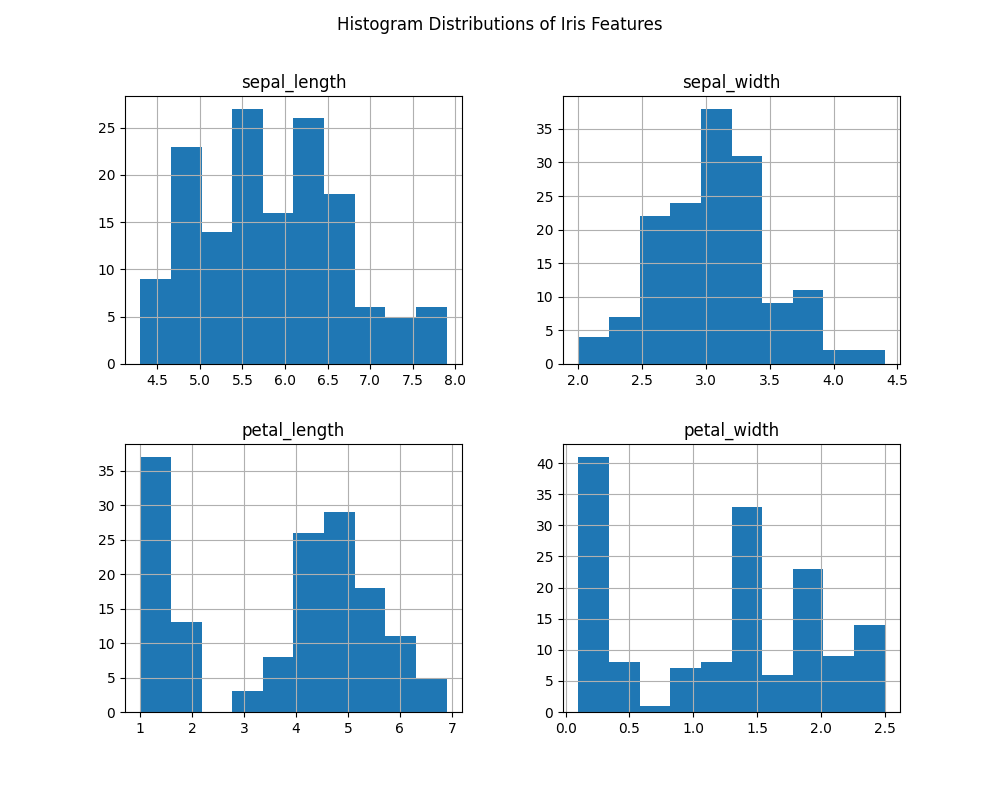
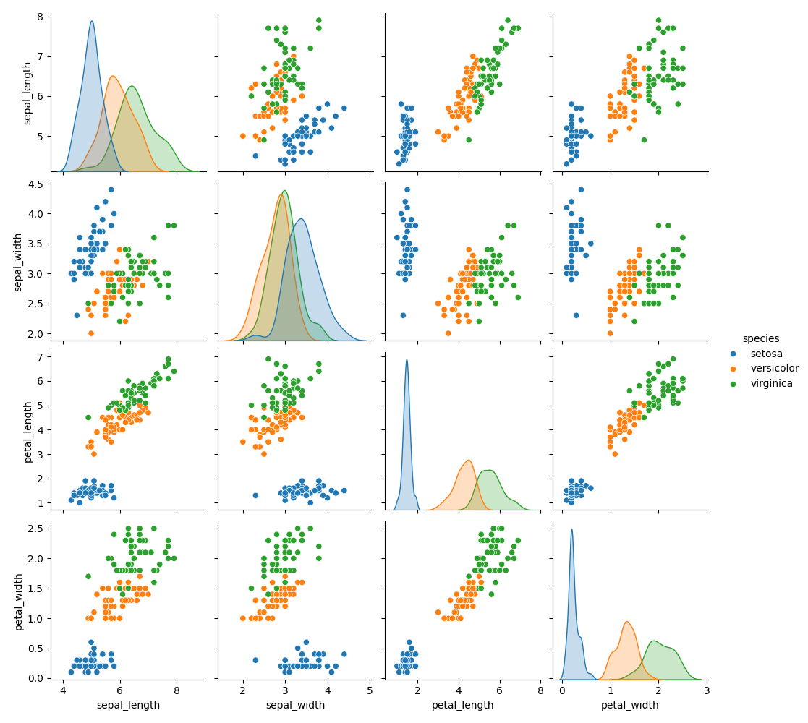
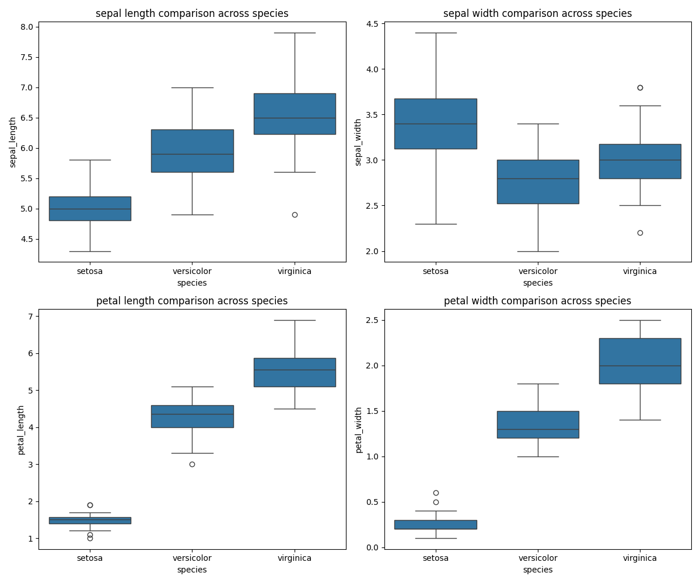

# Day 24: Iris Species Dataset Analysis

This project is part of the "30 Days of Datasets" challenge. For Day 24, we are exploring the classic Iris flower dataset, a well-known dataset in the world of machine learning and data science. The goal is to perform Exploratory Data Analysis (EDA) to understand the relationships between the features and distinguish between the different species of Iris flowers.

## The Dataset

The Iris dataset contains 150 samples from three species of Iris flowers (Setosa, Versicolor, and Virginica). For each sample, four features were measured in centimeters:

*   **sepal_length**: The length of the sepal.
*   **sepal_width**: The width of the sepal.
*   **petal_length**: The length of the petal.
*   **petal_width**: The width of the petal.
*   **species**: The species of the flower.

### Data Quality Check

The initial analysis of the dataset shows:
*   **Total Entries**: 150
*   **Features**: 5 columns
*   **Missing Values**: There are **no missing values**, making the dataset clean and ready for analysis.
*   **Data Types**: All feature columns are `float64`, and the target `species` column is an `object` (string).
*   **Species**: The three unique species are 'setosa', 'versicolor', and 'virginica'.

## Exploratory Data Analysis (EDA)

The main focus of this project is to visualize the data to uncover patterns, relationships, and key characteristics that differentiate the Iris species.

### 1. Feature Distributions (Histograms)

Histograms for each feature show how the measurements are distributed across all samples.

From the histograms, we can see that `sepal_length` and `sepal_width` have distributions that are roughly unimodal and bell-shaped. In contrast, `petal_length` and `petal_width` appear to be bimodal, suggesting there are two distinct groups of measurements within the dataset, which likely corresponds to the different species.

### 2. Relationships Between Features (Pair Plot)

A pair plot is an excellent tool for visualizing the relationships between all pairs of features, differentiated by species. The diagonal shows the distribution of each feature for each species.

This visualization provides several key insights:
*   The **Setosa** species (blue) is clearly and easily separable from the other two based on all feature combinations, especially its smaller petal length and width.
*   **Versicolor** (orange) and **Virginica** (green) show some overlap but are still largely distinct, particularly when looking at petal length and petal width.
*   **Petal length and petal width are the most powerful features** for classifying the three species, as they provide the clearest separation between the clusters.

### 3. Feature Comparison Across Species (Box Plots)

Box plots help us compare the distribution of each feature across the three species side-by-side.

These box plots clearly illustrate the differences in physical measurements:
*   **Petal length and petal width are the strongest differentiators**, showing a clear, stepped increase in size from setosa to versicolor to virginica, with almost no overlap between the species' distributions.
*   **Sepal length** also increases across the species in the same order, but with more overlap between them.
*   Interestingly, **sepal width** does not follow this trend; **setosa has the widest sepals on average**, while versicolor has the narrowest.

## Conclusion

The exploratory data analysis of the Iris dataset confirms why it is a classic benchmark for classification tasks. The three species are highly distinguishable based on their physical measurements, with **petal length and petal width** being the most effective features for separation. The Setosa species is linearly separable from the other two, while Versicolor and Virginica, though slightly overlapping, can also be classified with high accuracy. This analysis provides a strong foundation for building a machine learning model to predict the species of an Iris flower.

## Cite 

[kaggle iris dataset](https://www.kaggle.com/datasets/emanfatima2025/iris-growth-and-structure-dataset?select=iris.csv)