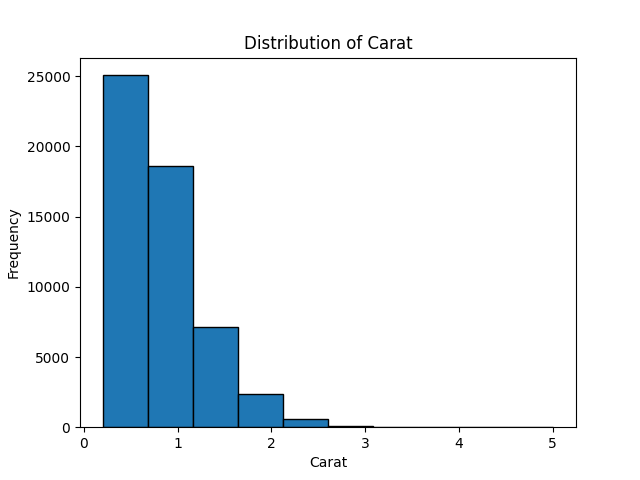
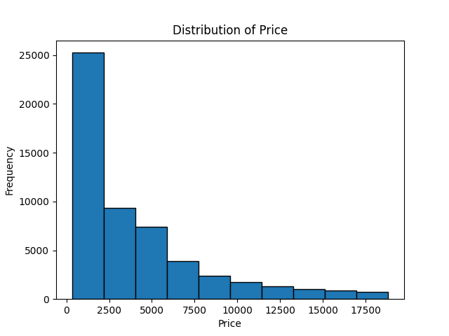
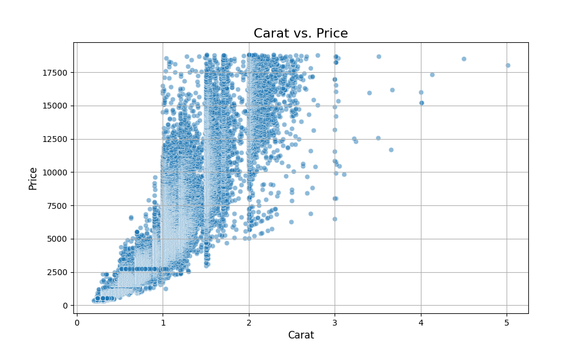
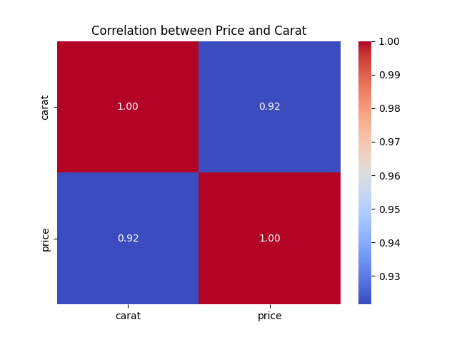
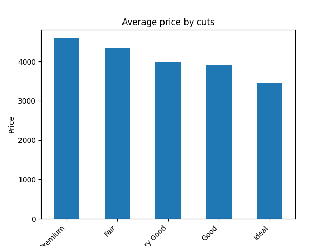
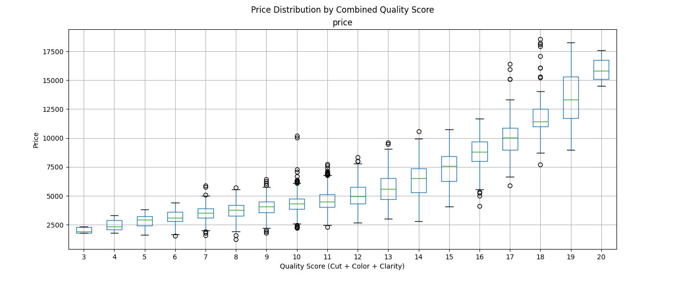

# Day 26: Diamonds Dataset Exploratory Analysis

This project is part of the "30 Days of Datasets" challenge. The focus for Day 26 is an Exploratory Data Analysis (EDA) of the popular Diamonds dataset. The goal is to uncover the key factors that influence a diamond's price and understand the relationships between its various attributes.

**Dataset Source:** [Kaggle Diamonds Dataset](https://www.kaggle.com/datasets/ayeshaseherr/diamonds)

## Dataset Overview

The dataset contains prices and other attributes of almost 54,000 diamonds. It consists of 10 features:

*   **price**: Price in US dollars (\$326--\$18,823)
*   **carat**: Weight of the diamond (0.2--5.01)
*   **cut**: Quality of the cut (Fair, Good, Very Good, Premium, Ideal)
*   **color**: Diamond color, from J (worst) to D (best)
*   **clarity**: A measurement of how clear the diamond is (I1 (worst), SI2, SI1, VS2, VS1, VVS2, VVS1, IF (best))
*   **x**: Length in mm (0--10.74)
*   **y**: Width in mm (0--58.9)
*   **z**: Depth in mm (0--31.8)
*   **depth**: Total depth percentage = z / mean(x, y) = 2 * z / (x + y) (43--79)
*   **table**: Width of top of diamond relative to widest point (43--95)

## Data Cleaning

Before analysis, a quick data quality check was performed:
*   **Duplicates**: The dataset contained 146 duplicated rows, which were removed to ensure data integrity. The final dataset has 53,794 unique entries.
*   **Null Values**: There were no null values found in the dataset.

## Exploratory Data Analysis (EDA)

The EDA was guided by several key questions to understand the dataset's structure and the drivers of diamond prices.

### 1. Are there extreme outliers in carat or price?

To answer this, we look at the distributions of `price` and `carat`.

| Distribution of Carat | Distribution of Price |
| :---: | :---: |
|  |  |

**Observations:**
*   Both distributions are heavily **right-skewed**.
*   **Carat**: The vast majority of diamonds are clustered under 1.5 carats, but a long tail extends towards 5.0 carats, indicating the presence of rare, high-carat outliers.
*   **Price**: Similarly, most diamonds are priced below \$5,000, but the distribution has a long tail with outliers priced over \$18,000.

**Conclusion**: Yes, both `carat` and `price` have significant extreme outliers on the higher end.

### 2. How strongly does carat influence price?

The relationship between `carat` and `price` is fundamental to diamond valuation.



**Observations from the scatter plot:**
*   There is a clear **strong, positive relationship**: as carat increases, the price increases.
*   The relationship is **exponential, not linear**. The price accelerates rapidly for diamonds above 2 carats. This is because larger diamonds are much rarer.

To confirm the strength of this relationship, a correlation heatmap was generated.



The Pearson correlation coefficient is **0.92**, which confirms a **very strong positive linear relationship**. Although the true relationship is exponential, the linear correlation is still exceptionally high because of the dominant, positive trend.

### 3. Do depth and table proportions affect the price?

While carat is dominant, other factors like `depth` are also considered in pricing. An "ideal" depth percentage allows for maximum brilliance.

First, we check for outliers in `depth` using a box plot.

**Observations:**
*   The data is tightly concentrated around the median (approx. 61.8%).
*   However, there are numerous outliers on both the high and low ends, indicating many diamonds fall outside the typical depth range.

Next, we check the correlation between `depth` and `price`.

The correlation coefficient between `depth` and `price` is **-0.01**, which is effectively zero. This indicates **no linear relationship**. This makes sense because diamond pricing penalizes values that are either too high or too low, favoring an ideal range in the middle.

### 4. Among diamonds with similar carat, which factor (cut, color, or clarity) has the biggest impact on price?

To isolate the effect of the "3 Cs", the analysis was focused on a subset of diamonds with a similar carat weight (0.9 to 1.1 carats).

The correlation between price and the ordinal values of `cut`, `color`, and `clarity` was calculated for this subset:

```
cut: correlation = 0.099
color: correlation = -0.318
clarity: correlation = 0.471
```
*Note: Color is negatively correlated because the categorical codes are mapped in reverse (higher code for a better, rarer color like 'D' which has a higher price).*

The bar chart below shows the average price for each cut grade within this carat range:



**Conclusion**: For diamonds of a similar carat, **clarity has the strongest influence on price**, followed by color, and then cut. While cut quality is important, its impact on price is less dramatic than the premiums paid for higher clarity and color grades.

### 5. Does a combined "Quality Score" create clear price tiers?

To test this, a `quality_score` was created by mapping each of the `cut`, `color`, and `clarity` grades to a numeric score and summing them up. This score represents a combined measure of a diamond's quality (excluding carat).



**Observations:**
*   As the `quality_score` increases, the median price tends to increase, confirming that overall quality drives price.
*   The combined score **does** create price tiers, especially at the lower and higher ends.
*   However, there's substantial overlap in the middle ranges (scores 10-16). This suggests that while these three factors together matter, carat weight remains a very dominant factor, creating significant price variation even within the same quality tier.

## How to Run This Project

1.  **Prerequisites**: Make sure you have Python and the following libraries installed:
    *   `pandas`
    *   `matplotlib`
    *   `seaborn`
    *   `scipy`
    *   `jupyter notebook` or `jupyter lab`

    You can install them using pip:
    ```bash
    pip install pandas matplotlib seaborn scipy jupyterlab
    ```

2.  **Dataset**: Place the `diamonds.csv` file inside a folder named `data` in the same directory as the notebook.

3.  **Execute the Notebook**: Launch Jupyter Lab/Notebook and open the `notebook.ipynb` file. Run the cells in sequential order to replicate the analysis.