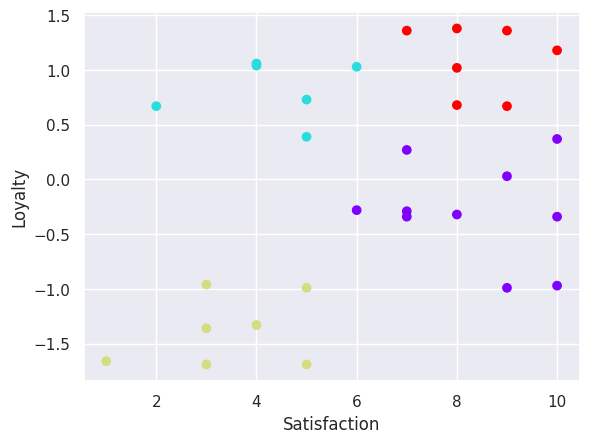

# Market Segmentation Analysis

This notebook performs market segmentation analysis on a dataset containing customer satisfaction and loyalty data.

## Objective

The objective of this analysis is to identify distinct customer segments based on their satisfaction and loyalty levels. This segmentation can help businesses tailor their marketing strategies and improve customer relationships.

## Data

The analysis uses a dataset with two variables:

- **Satisfaction:** A measure of customer satisfaction.
- **Loyalty:** A measure of customer loyalty.

## Methodology

1. **Data Loading and Exploration:** The data is loaded into a pandas DataFrame, and an initial scatter plot is generated to visualize the relationship between satisfaction and loyalty.

2. **K-Means Clustering (Initial):** An initial K-Means clustering is performed with two clusters without scaling the data. This highlights the importance of feature scaling when variables have different scales.

3. **Data Standardization:** The data is standardized using `preprocessing.scale()` to ensure that both satisfaction and loyalty contribute equally to the clustering process.

4. **Elbow Method:** The Elbow method is used to determine the optimal number of clusters by plotting the Within-Cluster Sum of Squares (WCSS) for different numbers of clusters. The "elbow point" in the plot indicates a good number of clusters.

5. **K-Means Clustering (with Standardization):** K-Means clustering is performed again using the standardized data and the optimal number of clusters determined by the Elbow method. In this case, 4 clusters were chosen.

6. **Cluster Visualization:** The data is visualized with the assigned cluster labels using the original satisfaction and loyalty values, but with the cluster predictions based on the standardized data. This provides a clear view of the identified segments.

## Results

The clustering analysis identified 4 distinct customer segments based on their satisfaction and loyalty:

- **Cluster 0:** Low Satisfaction, Low Loyalty (Alienated)
- **Cluster 1:** Low Satisfaction, High Loyalty (Roamers)
- **Cluster 2:** High Satisfaction, Low Loyalty (Supporters)
- **Cluster 3:** High Satisfaction, High Loyalty (Fans)

These segments are visualized in the scatter plot, with each cluster represented by a different color.

## Conclusion

The market segmentation analysis provides valuable insights into customer behavior based on satisfaction and loyalty. By understanding these distinct segments, businesses can develop targeted strategies to improve customer satisfaction, foster loyalty, and ultimately enhance business performance.